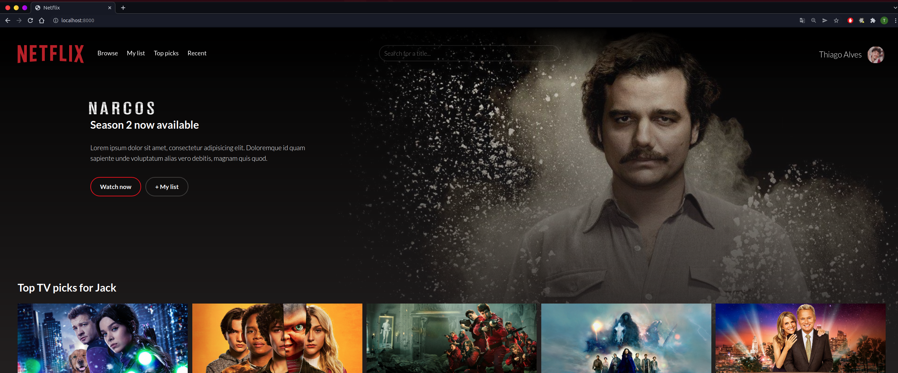
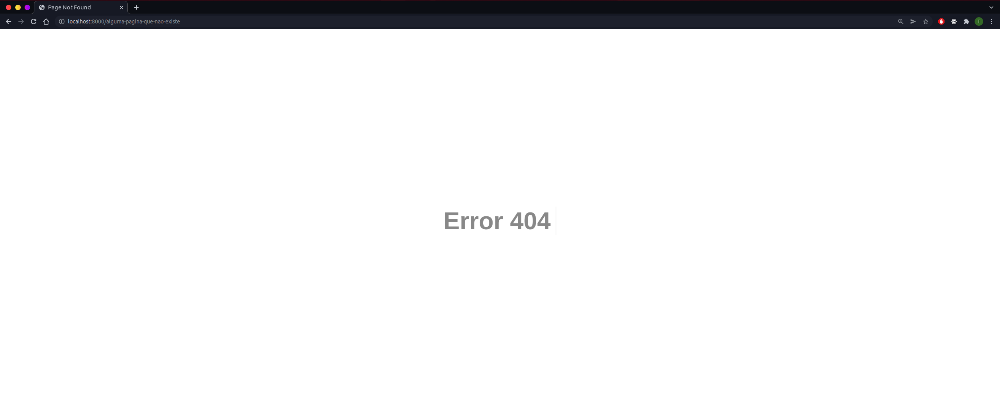

# Exemplo de Socket em Java

## Como executar este projeto

### Utilizando java
Este projeto foi criado utilizando o Java 11 como base.
```bash
# 1º Compilar
javac -d ./out/production ./src/com/sockets/*.java

# 2º Executar
java -Dfile.encoding=UTF-8 -classpath $(pwd)/out/production com.sockets.Main
```

### Utilizando Docker

```bash
# 1º Build
docker build -t socket .

# 2º Executar 
docker run --rm -p 8000:8000 socket
```


**OBS:** É possível adicionar qualquer documento HTML no diretório `/resources`,
este socket foi preparado para ler todos os documentos html's contidos neste diretório sem a necessidade
de reiniciar o programa.

## Página Inicial



## Quando uma página solicitada não é encontrado.

